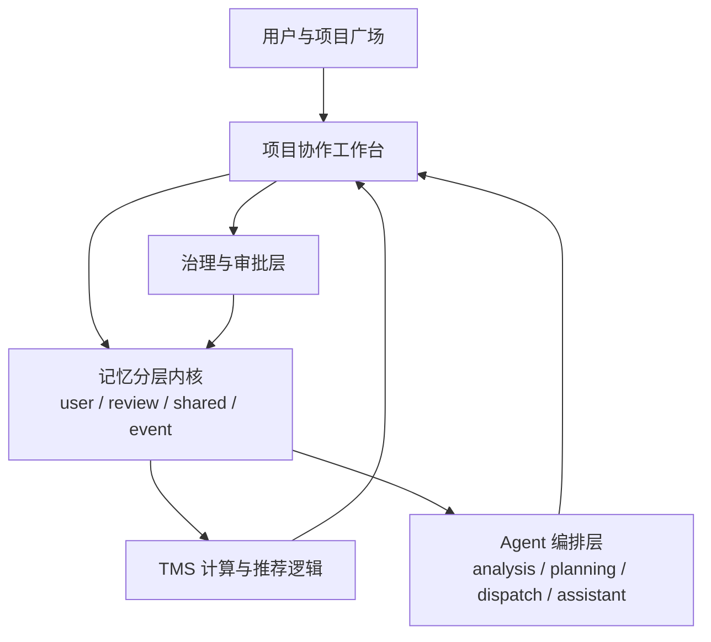
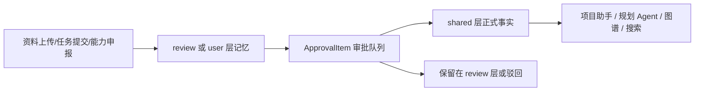

# 仓库技术实现文档

- 文档日期：2026-06-10
- 文档目的：基于当前工作区真实代码，输出一份可用于项目汇报、论文附录、课程答辩或团队交接的技术实现文档
- 扫描范围：`backend`、`frontend`、`docs`、`manual_simulation_pack_2026-06-06`，并同步识别同工作区内的参考仓与运行产物

---

## 1. 仓库总体说明

### 1.1 工作区不是单一仓库，而是“主系统 + 参考资料 + 运行产物”的混合工作区

当前 `C:\Users\Cxs07\Desktop\python` 不是单一 Git 仓库根目录，而是一个用于研究型 TMS 协作系统开发的混合工作区。扫描结果显示，真正承载当前项目业务实现的是以下目录：

1. `backend`
2. `frontend`
3. `docs`
4. `manual_simulation_pack_2026-06-06`

其余目录主要承担参考、验证、运行缓存或环境用途：

1. `neural-memory`
2. `outline`
3. `_reference_tms_repo`
4. `.venv`
5. `runtime-logs`
6. `backend-dev.log` / `frontend-dev.log` 等日志文件

结论：本次技术文档应以 `backend + frontend + docs + 手工模拟素材包` 为主线，不能把整个工作区误认为一个统一运行时系统。

### 1.2 当前主项目定位

从 [plan.md](C:\Users\Cxs07\Desktop\python\plan.md)、设计文档和源码实现可以确认，当前主项目是一个：

`基于 TMS（Transactive Memory System）理论的研究团队闭环协作系统原型`

其核心目标不是做通用 OA，也不是做普通任务管理，而是围绕研究团队协作，把以下对象纳入同一闭环：

1. 项目资料
2. 项目成员能力画像
3. 专家关系网络
4. Agent 分析与规划
5. 线性任务链执行
6. 下游验收与组长治理
7. 共享层问答
8. Trust / 置信度回算

---

## 2. 扫描结论与边界划分

### 2.1 核心代码目录

| 目录 | 角色 | 说明 |
|---|---|---|
| `backend` | 后端主服务 | FastAPI + Pydantic，负责 API、领域对象、内存仓库、工作流、LLM 接入、TMS 逻辑 |
| `frontend` | 前端主应用 | React + TypeScript + Vite，负责项目广场、工作台、治理视图、助手与图谱可视化 |
| `docs` | 设计与计划文档 | 保存系统设计、前端改版设计、阶段性计划 |
| `manual_simulation_pack_2026-06-06` | 手工验收素材包 | 用于模拟项目资料上传、能力申报、任务提交、验收、助手问答 |

### 2.2 参考目录

| 目录 | 性质 | 与主系统关系 |
|---|---|---|
| `neural-memory` | 参考仓 | 当前主系统没有直接 import 其运行时代码，主要参考图结构、记忆建模思想 |
| `outline` | 参考仓 | 当前主系统没有直接 import 其运行时代码，主要作为知识协作产品参考 |
| `_reference_tms_repo` | 理论/实现参考仓 | 作为 TMS 理论实现参考，不是当前主系统的直接运行依赖 |

说明：

1. 在 `backend` 和 `frontend` 主源码中，没有发现对 `neural-memory`、`outline`、`_reference_tms_repo` 的直接运行时依赖。
2. 设计文档 [2026-06-03-tms-project-closed-loop-redesign.md](C:\Users\Cxs07\Desktop\python\docs\superpowers\specs\2026-06-03-tms-project-closed-loop-redesign.md) 明确说明了 `neural-memory` 与 `outline` 的“参考方式”，但不是直接集成。

### 2.3 运行产物与噪声目录

以下内容不应纳入“系统实现主体”：

1. `frontend/node_modules`
2. `frontend/dist`
3. `backend/.pytest_cache`
4. `__pycache__`
5. `.venv`
6. `runtime-logs`
7. `backend-dev.log`、`frontend-dev.err.log` 等日志

---

## 3. 系统目标与业务闭环

### 3.1 业务目标

系统面向研究团队协作场景，目标是把“人、资料、计划、任务、验收、知识沉淀”串成一套 TMS 闭环，而不是只做静态知识库或任务板。

### 3.2 核心闭环

依据设计文档和代码实现，系统主闭环是：

1. 用户登录并进入项目广场
2. 创建项目或申请加入项目
3. 上传项目资料
4. 资料先进入审核层记忆
5. 提交项目内能力与证明
6. 系统生成专家画像与专家关系草稿
7. 组长批准后形成共享层正式事实
8. 组长运行分析 / 规划 Agent
9. 形成计划草稿
10. 组长审批计划
11. 生成线性任务链
12. 任务负责人提交结果
13. 下游成员开始验收
14. 验收通过后等待组长最终确认
15. 组长推进下一任务或收束闭环
16. 系统生成状态回算、置信度更新、专家网络更新提案
17. 项目助手只基于共享层回答问题

### 3.3 架构特征

该系统最重要的设计特征有三点：

1. `共享层 / 审核层 / 用户层 / 事件层` 的记忆分层不是附属功能，而是系统内核。
2. `组长治理` 是强约束，关键对象不能绕过审批直接成为正式事实。
3. V1 任务执行采用 `线性链式任务流`，但领域对象已预留 `DAG` 扩展字段。

---

## 4. 技术栈概览

### 4.1 后端

- 语言：Python
- Web 框架：FastAPI
- 数据建模：Pydantic v2
- 测试框架：pytest
- 文件解析：`pypdf`
- HTTP 客户端：`httpx`
- 当前存储方式：内存仓库 `InMemoryRepository`

依赖定义见：

1. [backend/requirements.txt](C:\Users\Cxs07\Desktop\python\backend\requirements.txt)
2. [backend/pyproject.toml](C:\Users\Cxs07\Desktop\python\backend\pyproject.toml)

### 4.2 前端

- 框架：React
- 语言：TypeScript
- 构建工具：Vite
- 图标库：`lucide-react`
- 样式方式：单文件 CSS 变量 + 组件类名

依赖定义见 [frontend/package.json](C:\Users\Cxs07\Desktop\python\frontend\package.json)。

### 4.3 项目规模快照

扫描时统计结果如下：

1. 后端主源码文件约 `27` 个
2. 前端源码文件约 `8` 个
3. FastAPI 路由约 `41` 个
4. 后端测试文件 `25` 个
5. 前端检查脚本 `19` 个

---

## 5. 系统总体架构

### 5.1 分层结构



### 5.2 后端真实实现方式

虽然 `backend/app` 中已经创建了 `api`、`memory`、`repositories`、`schemas`、`workflows`、`jobs` 等边界目录，但当前实际运行逻辑主要仍集中在：

1. [backend/app/main.py](C:\Users\Cxs07\Desktop\python\backend\app\main.py)
2. [backend/app/repository.py](C:\Users\Cxs07\Desktop\python\backend\app\repository.py)
3. [backend/app/workflows/plan_workflow.py](C:\Users\Cxs07\Desktop\python\backend\app\workflows\plan_workflow.py)
4. [backend/app/workflows/workflow_gate.py](C:\Users\Cxs07\Desktop\python\backend\app\workflows\workflow_gate.py)

这说明当前版本属于：

`“已做出领域边界，但核心实现仍偏集中式”的 V1 原型架构`

### 5.3 前端真实实现方式

前端当前是一个典型的单应用工作台，主状态集中在：

1. [frontend/src/App.tsx](C:\Users\Cxs07\Desktop\python\frontend\src\App.tsx)
2. [frontend/src/api.ts](C:\Users\Cxs07\Desktop\python\frontend\src\api.ts)
3. [frontend/src/types.ts](C:\Users\Cxs07\Desktop\python\frontend\src\types.ts)

辅助组件拆分为：

1. [frontend/src/components/cards.tsx](C:\Users\Cxs07\Desktop\python\frontend\src\components\cards.tsx)
2. [frontend/src/components/panels.tsx](C:\Users\Cxs07\Desktop\python\frontend\src\components\panels.tsx)
3. [frontend/src/expertiseMapGraph.tsx](C:\Users\Cxs07\Desktop\python\frontend\src\expertiseMapGraph.tsx)

这说明前端已经从“单页长面板”过渡到“左导航 + 中工作区 + 右详情/助手”的工作台架构，但状态仍然以 `App.tsx` 为核心聚合点。

---

## 6. 后端技术实现详解

## 6.1 入口与应用初始化

应用入口是 [backend/app/main.py](C:\Users\Cxs07\Desktop\python\backend\app\main.py)。

其职责包括：

1. 创建 FastAPI 实例
2. 初始化 `InMemoryRepository`
3. 配置 CORS
4. 定义全部 HTTP 路由
5. 在路由层做基础权限和模式校验

典型特点：

1. 仓储对象在 `create_app()` 时实例化，因此测试可以通过 `TestClient(create_app())` 创建隔离实例。
2. `main.py` 中内嵌了 `_require_user_project_access`、`_require_database_writable`、`_require_llm_available` 等守卫函数，形成统一入口校验。

## 6.2 领域模型设计

核心领域对象定义在 [backend/app/domain.py](C:\Users\Cxs07\Desktop\python\backend\app\domain.py)。

### 6.2.1 基础主体对象

1. `User`
2. `Project`
3. `ProjectMember`
4. `ProjectJoinRequest`
5. `Actor`

其中 `User` 偏登录/权限主体，`Actor` 偏协作与能力主体，两者通过 `actor_id` 关联。

### 6.2.2 项目资料与能力对象

1. `ProjectSource`
2. `CapabilitySubmission`
3. `ExpertProfileRecord`
4. `ExpertRelationRecord`
5. `ExpertiseClaim`

这组对象支撑“资料入库”和“能力画像”两条主流程。

### 6.2.3 计划与任务对象

1. `PlanTaskDraft`
2. `PlanRecord`
3. `Task`
4. `AgentRunRecord`
5. `AcceptanceRecord`

其中：

1. `PlanRecord` 表示计划草稿或正式计划
2. `Task` 表示批准后生成的执行任务
3. `AcceptanceRecord` 表示一次验收动作

### 6.2.4 记忆与治理对象

1. `MemoryItem`
2. `MemoryVersionEntry`
3. `Decision`
4. `TermEntry`
5. `ApprovalItem`
6. `AuditEvent`
7. `TrustEvent`

这组对象把知识沉淀、术语治理、审批、审计和 trust 更新统一到了一个模型层里。

### 6.2.5 辅助对象

1. `ProjectAssistantSession`
2. `ExpertiseMap`
3. `RecommendationResult`
4. `SearchResult`
5. `SystemState`

它们分别对应助手问答、图谱投影、专家推荐、搜索结果和系统降级状态。

## 6.3 存储实现：InMemoryRepository

当前系统没有接入数据库，全部业务对象都放在 [backend/app/repository.py](C:\Users\Cxs07\Desktop\python\backend\app\repository.py) 的 `InMemoryRepository` 中。

### 6.3.1 优点

1. 开发速度快
2. 测试易隔离
3. 便于验证复杂业务闭环
4. 无需数据库迁移即可快速迭代领域模型

### 6.3.2 局限

1. 服务重启即丢失数据
2. 无法支持多实例并发
3. 审计与版本仅存在进程内
4. 不具备真实生产级事务能力

### 6.3.3 当前适用性判断

对于“研究原型 + 答辩展示 + 手工闭环模拟”阶段，这种实现是合理的；对于正式部署则必须迁移到持久化存储。

## 6.4 Seed 种子数据

种子数据定义在 [backend/app/seed.py](C:\Users\Cxs07\Desktop\python\backend\app\seed.py)。

其内容包括：

1. 两个示例项目 `p1`、`p2`
2. 三个真实成员用户与一个 AI actor
3. 初始任务、记忆、决策、术语、交接包
4. 五类以上工作流样本

这一设计的价值在于：

1. 前端进入工作台后不空白
2. 推荐算法和图谱可直接演示
3. 测试能覆盖已有真实语义对象

## 6.5 API 设计

### 6.5.1 路由规模

`main.py` 中共定义约 `41` 个路由，覆盖：

1. 健康检查
2. 用户与项目广场
3. 项目资料上传
4. 能力申报
5. Agent 规划
6. 计划审批与重做
7. 任务提交与验收
8. 项目助手
9. 记忆、术语、审批
10. 工作流推进
11. LLM 配置与诊断
12. 图谱、搜索、trust 事件

### 6.5.2 典型 API 分类

#### 用户与项目

1. `GET /api/users`
2. `GET /api/users/{user_id}/plaza`
3. `POST /api/users/{user_id}/projects`
4. `POST /api/users/{user_id}/projects/{project_id}/join-requests`

#### 资料与能力

1. `POST /project-sources/text`
2. `POST /project-sources/pdf`
3. `POST /project-sources/markdown`
4. `POST /capability-submissions`

#### 规划与任务

1. `POST /agent-runs`
2. `POST /plans/{plan_id}/approve`
3. `PUT /plans/{plan_id}`
4. `POST /plans/{plan_id}/regenerate`
5. `POST /tasks/{task_id}/submit`
6. `POST /tasks/{task_id}/acceptance/start`
7. `POST /tasks/{task_id}/acceptance/decide`

#### 治理与辅助

1. `GET /approvals`
2. `POST /approvals/{approval_id}/decide`
3. `GET /terms`
4. `POST /terms`
5. `POST /assistant/query`
6. `POST /trust-events`
7. `GET /search`

## 6.6 记忆分层实现

### 6.6.1 分层定义

`MemoryItem.memory_layer` 支持以下四层：

1. `user`
2. `review`
3. `shared`
4. `event`

### 6.6.2 设计意义

1. `user`：个人提交产物，不能直接视为项目正式事实
2. `review`：待组长审批的候选事实
3. `shared`：项目正式共享事实
4. `event`：系统事件、驳回记录、回算线索

### 6.6.3 典型流转



### 6.6.4 可见性控制

当前可见性依赖：

1. `memory_layer`
2. `shared`
3. `owner_user_id`
4. `visible_to_user_ids`

测试 [test_memory_visibility.py](C:\Users\Cxs07\Desktop\python\backend\tests\test_memory_visibility.py) 已验证：

1. 待审核资料对提交者和组长可见
2. 对其他成员不可见
3. 批准后进入 `shared`，再对全员可见

## 6.7 项目资料导入实现

资料导入由以下服务支撑：

1. [backend/app/services/ingest.py](C:\Users\Cxs07\Desktop\python\backend\app\services\ingest.py)
2. [repository.py](C:\Users\Cxs07\Desktop\python\backend\app\repository.py) 中的 `create_project_source_*` 系列方法

支持三种输入：

1. 粘贴文本
2. PDF
3. Markdown

导入流程为：

1. 接口接收输入
2. 文本提取
3. 创建 `ProjectSource`
4. 自动生成 `project_seed` 类型审核层记忆
5. 进入审批流

## 6.8 项目内能力画像实现

### 6.8.1 入口

能力申报入口为：

`POST /api/users/{user_id}/projects/{project_id}/capability-submissions`

### 6.8.2 核心逻辑

能力画像依赖以下实现：

1. `CapabilitySubmission`
2. `_extract_capability_claims_with_llm`
3. `infer_capability_claims`
4. `compute_initial_confidence`
5. `_create_relation_snapshot`

### 6.8.3 处理方式

系统先尝试走 LLM 结构化抽取；如果不可用，则退化到规则抽取：

1. 从能力描述与证明材料中识别领域、方法、工具
2. 生成 `ExpertiseClaim`
3. 计算 `confidence_breakdown`
4. 生成 `ExpertProfileRecord`
5. 生成候选 `ExpertRelationRecord`
6. 将专家画像及关系快照送入审批队列

### 6.8.4 特点

1. 能力是按项目隔离的，不复用全局医学专家档案
2. 证明 PDF 当前是可选项，但被纳入置信度计算
3. 图谱只对已审批能力形成正式网络

## 6.9 Agent 编排与规划实现

### 6.9.1 Prompt 设计

Prompt 位于 [backend/app/agents/prompts.py](C:\Users\Cxs07\Desktop\python\backend\app\agents\prompts.py)，包含：

1. `ANALYSIS_AGENT_SYSTEM_PROMPT`
2. `PLAN_AGENT_SYSTEM_PROMPT`
3. `DISPATCH_AGENT_SYSTEM_PROMPT`
4. `CAPABILITY_EXTRACTION_SYSTEM_PROMPT`

特点：

1. 全中文输出约束
2. 只允许输出 JSON
3. 明确不能越权审批
4. 明确不能把草稿当正式事实

### 6.9.2 规划服务

规划核心服务是 [backend/app/workflows/plan_workflow.py](C:\Users\Cxs07\Desktop\python\backend\app\workflows\plan_workflow.py) 的 `PlanWorkflowService`。

其负责：

1. 评估资料是否满足规划条件
2. 运行分析 Agent
3. 运行计划 Agent
4. 必要时回退到骨架计划
5. 生成 `PlanRecord`
6. 批准后生成任务链和闭环工作流

### 6.9.3 规划 readiness 机制

这是当前实现的亮点之一。

系统不会无脑生成计划，而是先检查：

1. 是否有共享层正式资料
2. 是否有项目目标
3. 是否有项目范围
4. 是否有约束条件
5. 是否有已审批能力画像

输出 `PlanningReadiness`：

1. `ready`
2. `risky_but_generatable`
3. `blocked`

这使系统具备：

1. 风险提示
2. 补料建议
3. 强制生成高风险草稿
4. 禁止直接批准高风险草稿

### 6.9.4 LLM 降级策略

规划服务实现了多级回退：

1. 正常 LLM 生成
2. JSON 修复与补齐
3. 紧凑补全重试
4. 规则骨架回退
5. 直接返回 blocked 计划

这在 [test_planning_flow.py](C:\Users\Cxs07\Desktop\python\backend\tests\test_planning_flow.py) 和 [test_planning_de_templatization.py](C:\Users\Cxs07\Desktop\python\backend\tests\test_planning_de_templatization.py) 中有覆盖。

## 6.10 任务链与闭环推进实现

### 6.10.1 任务链生成

计划批准后，`PlanWorkflowService.approve_plan()` 会：

1. 把 `PlanTaskDraft` 转成正式 `Task`
2. 设置 `predecessor_task_id`
3. 设置 `dependency_ids`
4. 仅激活第一步任务
5. 其余任务保持 `pending`

### 6.10.2 闭环工作流

任务闭环由 [backend/app/workflows/workflow_gate.py](C:\Users\Cxs07\Desktop\python\backend\app\workflows\workflow_gate.py) 中的 `WorkflowGateService` 管理。

它把每条计划映射为一个 `TMSWorkflow`，状态门包括：

1. `waiting_upstream_submission`
2. `waiting_downstream_acceptance`
3. `waiting_leader_confirmation`
4. `rework_required`
5. `completed`

### 6.10.3 推进规则

1. 上游负责人提交结果后，流程变为等待下游验收
2. 下游开始验收后，形成 `AcceptanceRecord`
3. 下游通过后，不立即解锁下一步，而是等待组长最终确认
4. 组长确认后，前一步置为完成，下一步置为 `assigned`
5. 驳回会把流程切换到 `rework_required`

### 6.10.4 回算提案

组长确认推进时，系统会自动生成三类提案记忆：

1. 置信度更新提案
2. 项目状态更新提案
3. 专家网络更新提案

这体现了 TMS 闭环不是“任务完成即结束”，而是“任务结果要反哺认知结构”。

## 6.11 项目助手实现

### 6.11.1 助手定位

项目助手不是通用聊天机器人，而是：

`只基于共享层正式内容回答项目问题的只读助手`

### 6.11.2 实现位置

1. 服务逻辑：[backend/app/services/assistant.py](C:\Users\Cxs07\Desktop\python\backend\app\services\assistant.py)
2. 仓储封装：`repository.answer_project_question`

### 6.11.3 安全边界

当前实现明确限制：

1. 只读共享层
2. 不读取未审批 review 记忆
3. 不读取他人 user 层记忆
4. 问到未确认内容时要明确拒答或提示边界

测试 [test_project_assistant.py](C:\Users\Cxs07\Desktop\python\backend\tests\test_project_assistant.py) 已覆盖这一点。

## 6.12 图谱与推荐实现

### 6.12.1 专家图谱

图谱投影由 [backend/app/services/expertise_map.py](C:\Users\Cxs07\Desktop\python\backend\app\services\expertise_map.py) 生成。

支持四种视图：

1. `person`
2. `topic`
3. `project`
4. `trust`

图节点类型包括：

1. Actor
2. ProjectExpert
3. Domain
4. Method
5. Tool
6. Outcome

### 6.12.2 专家推荐

推荐逻辑位于 [backend/app/tms.py](C:\Users\Cxs07\Desktop\python\backend\app\tms.py)。

评分因子包括：

1. 领域匹配
2. 验证状态
3. 历史 trust
4. 角色适配
5. AI 协作代理加成

这使推荐结果不只是关键词匹配，而是带原因解释的排序结果。

## 6.13 搜索与系统模式

### 6.13.1 搜索

系统提供项目级搜索接口；当前当向量检索不可用时，会回落到 `keyword_fallback`。

### 6.13.2 系统模式

`SystemState` 支持：

1. `normal`
2. `manual_collaboration`
3. `readonly_protection`
4. `low_confidence`

用途：

1. LLM 不可用时降级到人工协作
2. 数据不可写时进入只读保护
3. 在前端统一呈现系统状态

---

## 7. 前端技术实现详解

## 7.1 总体架构

前端主应用在 [frontend/src/App.tsx](C:\Users\Cxs07\Desktop\python\frontend\src\App.tsx)，实现了：

1. 登录页
2. 项目广场
3. 项目工作台
4. 模态抽屉
5. 右侧详情栏
6. AI 助手常驻区

### 7.1.1 信息架构

一级导航包括：

1. 项目总览
2. 任务与实验
3. 团队记忆
4. 专家网络
5. 术语与治理
6. 决策与交接

这与前端设计文档 [2026-06-09-frontend-ui-redesign-design.md](C:\Users\Cxs07\Desktop\python\docs\superpowers\specs\2026-06-09-frontend-ui-redesign-design.md) 一致。

### 7.1.2 布局结构

桌面端采用三栏布局：

1. 左侧导航栏
2. 中部主工作区
3. 右侧详情 / 助手栏

中小屏时右侧栏隐藏，助手移动到主区域顶部。

## 7.2 状态管理

当前前端仍以 `useState + useEffect` 为主，没有使用 Redux、Zustand 或 React Query。

优点：

1. 原型开发快
2. 状态链条直观

不足：

1. `App.tsx` 状态较重
2. 页面、弹层、远程数据和业务动作耦合较高
3. 后续继续扩展会增加维护成本

## 7.3 API 封装

[frontend/src/api.ts](C:\Users\Cxs07\Desktop\python\frontend\src\api.ts) 对后端 API 做了集中封装。

特点：

1. 默认 `API_BASE` 指向 `http://127.0.0.1:8010`
2. 统一 `request<T>()` 泛型封装
3. 自动区分 JSON 与 `FormData`
4. 上传 PDF / Markdown 时走表单请求

这使前端调用层和页面逻辑保持了一定分离。

## 7.4 类型系统

[frontend/src/types.ts](C:\Users\Cxs07\Desktop\python\frontend\src\types.ts) 与后端领域模型做了较完整对齐。

它覆盖了：

1. Project / User / PlazaProjectCard
2. Task / Memory / Decision / Workflow
3. PlanRecord / PlanningRunResult
4. Approval / Term / AgentIntake / ExpertiseMap
5. Workspace 聚合对象

这对前后端协同非常重要，降低了字段漂移风险。

## 7.5 组件划分

### 7.5.1 卡片组件

[frontend/src/components/cards.tsx](C:\Users\Cxs07\Desktop\python\frontend\src\components\cards.tsx) 负责：

1. `TaskCard`
2. `MemoryCard`
3. `DecisionCard`
4. `HandoverCard`
5. `ActorCard`
6. `WorkflowCard`

它们将不同对象的展示逻辑模块化。

### 7.5.2 面板组件

[frontend/src/components/panels.tsx](C:\Users\Cxs07\Desktop\python\frontend\src\components\panels.tsx) 负责：

1. 登录页
2. 广场页
3. 规划面板
4. 智能录入面板
5. 助手面板
6. 详情视图
7. 全局状态条
8. 抽屉 Backdrop

这些组件把复杂交互封装为可复用的展示单元。

## 7.6 专家图谱可视化

[frontend/src/expertiseMapGraph.tsx](C:\Users\Cxs07\Desktop\python\frontend\src\expertiseMapGraph.tsx) 使用 SVG 自绘图谱。

特点：

1. 不依赖第三方图可视化库
2. 按 `view` 切换不同节点分组
3. 自定义节点颜色、边颜色和布局
4. 点击节点查看关系摘要

这使图谱功能足够轻量，适合原型阶段。

## 7.7 视觉系统与交互风格

样式位于 [frontend/src/styles.css](C:\Users\Cxs07\Desktop\python\frontend\src\styles.css)。

特征如下：

1. 使用 CSS 变量定义主题色
2. 整体风格偏浅色、玻璃感、科技 B 端工作台
3. 通过三栏布局、卡片层次和助手常驻提升信息架构
4. 通过 `thinking-overlay` 呈现大模型运行态
5. 通过响应式断点适配桌面与平板/手机

## 7.8 前端当前实现亮点

1. 页面语言已统一为中文
2. AI 助手保持常驻
3. 规划风险、补料建议、高风险草稿等状态在界面上有明确呈现
4. 工作流推进与任务验收动作可视化较明确
5. 图谱与审批、术语、交接已经形成完整信息架构

## 7.9 前端当前局限

1. `App.tsx` 体量较大，职责集中
2. 缺少更细颗粒度的状态管理方案
3. 部分前端校验脚本仍依赖旧的字符串检查方式，和当前重构写法不完全一致

---

## 8. 测试、验证与运行状态

## 8.1 后端测试

后端测试位于 `backend/tests`，共 `25` 个测试文件。

覆盖主题包括：

1. API 基础行为
2. 项目广场与权限
3. 资料导入
4. 记忆可见性
5. 能力画像
6. 规划流程
7. 高风险草稿与补料
8. 计划批准与任务发放
9. 任务提交与验收
10. 组长最终推进
11. 项目助手
12. 系统模式切换
13. Trust 事件
14. 图谱与搜索
15. 架构边界约束

### 8.1.1 实测结果

在仓库虚拟环境 `.venv` 下执行：

```powershell
& 'C:\Users\Cxs07\Desktop\python\.venv\Scripts\python.exe' -m pytest -q
```

结果：

`110 passed in 18.27s`

### 8.1.2 环境差异说明

若直接使用系统 Python 运行：

```powershell
pytest -q
```

会因为缺少 `pypdf` 导致测试收集失败。说明当前测试依赖应以项目 `.venv` 为准。

## 8.2 前端构建验证

执行：

```powershell
npm run build
```

结果：构建通过。

构建产物显示：

1. `dist/index.html`
2. `dist/assets/index-*.css`
3. `dist/assets/index-*.js`

说明当前前端可完成生产构建。

## 8.3 前端脚本检查

### 8.3.1 通过项

执行：

```powershell
node scripts/check-navigation.mjs
```

结果：

`导航行为检查通过`

### 8.3.2 未通过项

执行：

```powershell
node scripts/check-tms-features.mjs
```

结果报错：

`TMS 前端能力缺失：App.tsx:workspace.terms, App.tsx:workspace.approvals`

分析：

1. 当前 `Workspace` 类型和实际数据中确实包含 `terms`、`approvals`
2. 失败原因更像脚本在做源码字符串级检查，而当前 `App.tsx` 重构后未保留脚本期待的字面量访问痕迹
3. 这属于“检查脚本与当前实现写法不同步”，不完全等于功能真实缺失

结论：应把它记录为“前端验证脚本待同步更新”的工程项。

---

## 9. 与设计文档和素材包的关系

## 9.1 docs 的作用

`docs/superpowers/specs` 下的文档不是运行时代码，而是设计依据。

关键文档包括：

1. [2026-06-01-tms-research-collaboration-system-design.md](C:\Users\Cxs07\Desktop\python\docs\superpowers\specs\2026-06-01-tms-research-collaboration-system-design.md)
2. [2026-06-03-tms-project-closed-loop-redesign.md](C:\Users\Cxs07\Desktop\python\docs\superpowers\specs\2026-06-03-tms-project-closed-loop-redesign.md)
3. [2026-06-08-tms-planning-de-templatization-design.md](C:\Users\Cxs07\Desktop\python\docs\superpowers\specs\2026-06-08-tms-planning-de-templatization-design.md)
4. [2026-06-09-frontend-ui-redesign-design.md](C:\Users\Cxs07\Desktop\python\docs\superpowers\specs\2026-06-09-frontend-ui-redesign-design.md)

这些文档和当前代码之间总体一致，尤其在以下方面：

1. 共享层 / 审核层 / 用户层记忆分层
2. 单组长治理
3. 规划 readiness 与补料分支
4. 线性任务闭环
5. 前端六大工作区

## 9.2 手工模拟素材包的作用

[manual_simulation_pack_2026-06-06](C:\Users\Cxs07\Desktop\python\manual_simulation_pack_2026-06-06) 不是系统种子数据，而是人工验证脚本包。

用途：

1. 测项目资料上传
2. 测能力申报与 PDF 证明
3. 测补料流程
4. 测任务提交与验收
5. 测项目助手问答

它相当于“演示与验收手册数据集”。

---

## 10. 当前实现亮点总结

### 10.1 业务闭环完整

当前版本已经不是静态界面，而是具备以下真实闭环：

1. 项目创建与入组审批
2. 资料上传与记忆审阅
3. 能力结构化与项目级专家画像
4. 规划 Agent 与草稿审批
5. 正式任务链生成
6. 提交、验收、组长确认
7. 回算提案
8. 共享层问答

### 10.2 治理边界明确

系统特别强调：

1. 普通成员不能直接批准关键内容
2. AI 不能直接给正式结论
3. 高风险草稿不能直接批准
4. 项目助手不能越权读取未确认内容

这使系统在研究协作场景下更可信。

### 10.3 工程可验证性较强

当前后端已有 `110` 个通过测试，说明项目不是“只做界面演示”，而是有相对扎实的行为验证。

---

## 11. 当前问题、风险与后续演进

## 11.1 当前问题

1. 后端仍以 `InMemoryRepository` 为中心，未接数据库
2. 前端 `App.tsx` 过大
3. 部分 workflow / memory / repositories 目录仍是边界壳，不是完全分层实现
4. 前端部分脚本校验与当前源码写法不同步

## 11.2 关键工程风险

1. 当前默认 LLM Provider 配置中存在硬编码默认密钥做法，这在正式环境下不安全，应该改为环境变量或密钥管理方案
2. 内存仓库存储无法支撑生产部署
3. 规划与助手虽然有 LLM 回退，但仍依赖外部模型服务的稳定性
4. 图谱与搜索当前仍偏轻量，未接入真实持久化图数据库或向量库

## 11.3 建议的 V2 演进方向

1. 将 `InMemoryRepository` 迁移到 PostgreSQL + Redis
2. 将审批、计划、任务、记忆拆分成独立 repository / service
3. 将 `App.tsx` 拆成页面级容器组件
4. 把前端检查脚本从字符串扫描升级为组件行为测试
5. 为 trust 回算、搜索、图谱增加更真实的数据后端
6. 为 LLM 接口增加环境变量配置、密钥托管和审计追踪
7. 将线性任务链升级为真正的 DAG 执行图

---

## 12. 结论

当前工作区中，真正完成较高集成度实现的是 `backend + frontend` 这套 TMS 研究团队协作系统原型。

它已经具备以下特征：

1. 以 TMS 理论为核心，而非普通任务系统
2. 拥有完整的项目资料、能力、规划、执行、验收、回算、问答闭环
3. 前后端均已实现且可运行
4. 后端测试覆盖较完整
5. 前端工作台结构较成熟
6. 仍保留明显的 V1 原型特征，适合演示、答辩和后续继续工程化

如果用于答辩，可以把它定位为：

`“一个已经完成从理论到系统原型落地、并验证了关键闭环机制的 TMS 协作平台 V1”`

---

## 13. 答辩 Q&A

以下问答按答辩高频问题组织，可直接使用。

### Q1：这个项目到底解决什么问题？

A：它解决的是研究团队协作中的“知识分散、责任断裂、任务交接不清、经验无法沉淀”的问题。系统不是单纯发任务，而是把项目资料、专家能力、任务执行、验收回流和共享知识统一到一个 TMS 闭环里。

### Q2：为什么不是普通任务管理系统？

A：普通任务系统关注任务状态，而这个系统关注“谁知道什么、谁适合做什么、做完以后如何变成项目正式事实”。它的核心是 memory layer、专家画像、组长治理和 trust 回算，而不只是待办事项。

### Q3：为什么引入 TMS 理论？

A：TMS 强调团队中的知识分工与“我知道谁知道什么”。本系统把这种理论映射成项目内能力画像、专家关系、推荐逻辑和协作闭环，因此比传统任务板更适合知识密集型研究团队。

### Q4：系统的核心技术亮点是什么？

A：有四个亮点：一是记忆四层分层；二是规划 readiness 和补料机制；三是线性任务链的验收门控；四是共享层只读助手与 trust 回算提案。

### Q5：为什么项目资料和任务结果不能直接进入共享层？

A：因为研究协作里“提交”不等于“正式事实”。系统通过 review 层和审批队列，把草稿、个人理解和正式事实区分开，减少错误知识扩散。

### Q6：为什么要有组长治理？

A：这是为了保证正式共享层的可信性。V1 采用单组长治理，所有关键共享事实、正式计划和最终推进都必须由组长确认，这样可以避免 AI 或普通成员误把草稿变成正式结论。

### Q7：为什么先做线性任务链，不直接做 DAG？

A：线性链更容易验证闭环逻辑，也更适合原型阶段快速落地。但领域模型已经保留了 `dependency_ids` 等字段，为后续 DAG 升级做了准备。

### Q8：规划 Agent 为什么要先做 readiness 检查？

A：因为资料不完整时，LLM 很容易生成看起来合理但实际空泛的计划。readiness 检查可以先判断缺什么、风险在哪里、能不能强行生成高风险草稿，从而把“规划质量”变成可解释状态。

### Q9：什么是高风险草稿？

A：高风险草稿是在资料不完整但用户坚持继续时生成的临时计划，它只允许用于讨论和补料，不允许直接批准为正式执行计划。

### Q10：项目助手为什么只读共享层？

A：因为助手如果能直接读到未验收或私有内容，就会破坏治理边界。共享层只读的设计保证它回答的是“正式确认的信息”，而不是草稿或隐私内容。

### Q11：这个系统的后端为什么选择 FastAPI？

A：FastAPI 适合快速构建结构化 API，和 Pydantic 配合能很好承载复杂领域模型，也方便测试和前后端联调。

### Q12：为什么当前没有数据库？

A：当前版本定位是研究原型和答辩可运行版本，使用 `InMemoryRepository` 可以快速验证复杂业务闭环，降低早期数据库设计成本。后续生产化时会迁移到 PostgreSQL/Redis。

### Q13：这会不会导致数据不安全？

A：如果用于正式生产当然不够安全，因为重启会丢失数据。当前实现更强调原型验证和流程正确性，而不是生产级持久化。

### Q14：系统如何处理 LLM 不可用？

A：系统有两类降级：一类是在系统状态上切换到 `manual_collaboration`，暂停智能录入；另一类是在规划流程中通过 fallback 生成规则骨架计划，避免整个流程完全中断。

### Q15：如何证明这不是一个纯前端 Demo？

A：后端有 `110` 个通过测试，覆盖资料、能力、规划、审批、验收、助手、trust、搜索、系统模式等行为，说明它具有真实的业务逻辑和验证基础。

### Q16：前端实现最大的特点是什么？

A：前端不是简单大长页，而是按六个工作区做成了三栏工作台，AI 助手常驻，审批与风险状态清晰，任务、记忆、图谱和治理都可在统一界面中操作。

### Q17：为什么前端没有上 Redux 或 React Query？

A：当前为了原型速度采用了 `useState + useEffect`。这让开发成本更低，但也带来了 `App.tsx` 偏重的问题，后续如果进入持续迭代阶段，建议拆分状态管理。

### Q18：专家推荐是怎么做的？

A：推荐基于任务标签、成员已验证专长、历史 trust、角色适配和 AI 协作能力做打分，最后返回可解释候选列表，而不是黑箱输出一个名字。

### Q19：trust 回算体现在哪里？

A：组长在验收推进时，系统会自动生成置信度更新提案、项目状态提案和专家网络提案。这表示每次任务闭环不只是完成工作，还会反哺团队认知结构。

### Q20：为什么要把用户层、审核层、共享层分开？

A：因为研究协作中的信息可信度天然不同。用户层是个人提交，审核层是候选事实，共享层才是正式事实。这种分层是系统可信性的基础。

### Q21：和知识库系统相比，这个系统多了什么？

A：知识库主要回答“存什么”，而本系统同时回答“谁负责、谁审核、何时生效、如何回流更新专家网络”。它是知识、任务和治理融合的系统。

### Q22：和传统项目管理系统相比，这个系统多了什么？

A：传统项目系统侧重流程节点，而本系统把记忆、能力、图谱和 trust 一起纳入，因此更像“协作认知系统”。

### Q23：为什么工作区里还有 `neural-memory` 和 `outline`？

A：它们是同工作区内的参考仓，不是当前系统的运行时依赖。当前主系统没有直接 import 它们的代码，更多是参考图结构建模和知识协作产品设计思路。

### Q24：手工模拟素材包有什么作用？

A：它提供了一套完整演示数据，用于手动跑通项目创建、补料、能力申报、任务提交、验收和项目助手问答，因此非常适合答辩现场演示。

### Q25：项目当前最大的工程风险是什么？

A：一是内存仓库不适合正式部署；二是 LLM 默认配置存在安全治理问题；三是前端主组件过大；四是个别检查脚本和当前实现写法不同步。

### Q26：如果继续做下去，下一步最重要的工程任务是什么？

A：第一优先级是持久化改造，把内存仓库迁移到数据库；第二是拆后端服务边界；第三是拆前端状态与页面容器；第四是把线性任务链升级为 DAG。

### Q27：如果老师问“你们到底实现了什么，不要讲设计”，该怎么答？

A：可以直接说：我们已经实现了真实的前后端系统，支持项目广场、入组审批、项目资料上传、能力画像、规划 Agent、计划审批、正式任务链、任务提交、下游验收、组长推进、共享层助手、trust 事件和专家图谱，并且后端测试全部通过。

### Q28：如果老师问“为什么说这是闭环”，该怎么答？

A：因为系统不是到任务完成就结束，而是从项目资料进入，到计划生成，到任务执行，到验收，再到共享层更新和 trust 回算，最后还能被项目助手继续使用，形成信息回流。

### Q29：如果老师问“AI 在这个系统里是不是权力太大”，该怎么答？

A：不是。AI 只能做分析、规划、结构化和建议，不能直接审批、不能直接确认共享事实、不能直接给最终结论。最终治理权仍然在组长。

### Q30：如果老师问“你觉得这个系统现在是完成品吗”，该怎么答？

A：它不是生产完成品，但它已经是一个完成度较高的研究原型。核心业务闭环已经跑通，关键行为有测试验证，剩下的主要是数据库化、工程拆分和规模化能力扩展。

---

## 14. 答辩时的简短总结话术

可以直接使用下面这段：

> 本项目实现的是一个基于 TMS 理论的研究团队闭环协作系统原型。它把项目资料、成员能力、专家关系、Agent 规划、任务执行、验收回流和共享知识统一到了同一套前后端系统中。当前版本已经完成完整主闭环，后端在项目虚拟环境下 110 个测试全部通过，前端生产构建通过，说明它不是概念设计，而是一个可运行、可演示、可继续工程化扩展的系统原型。
